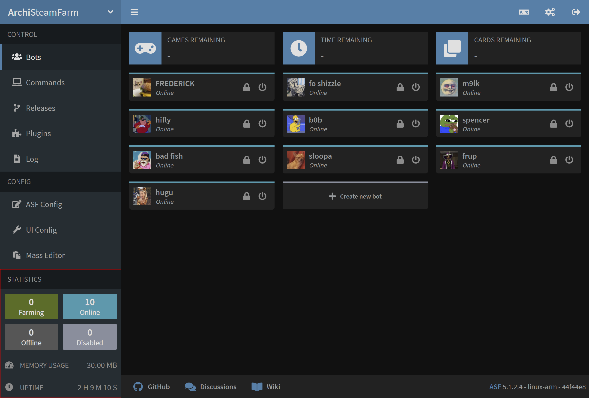
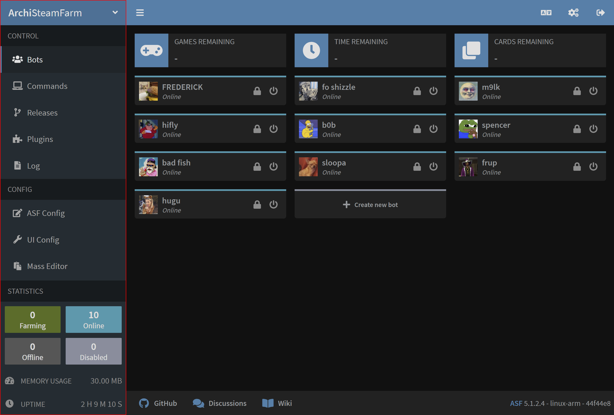
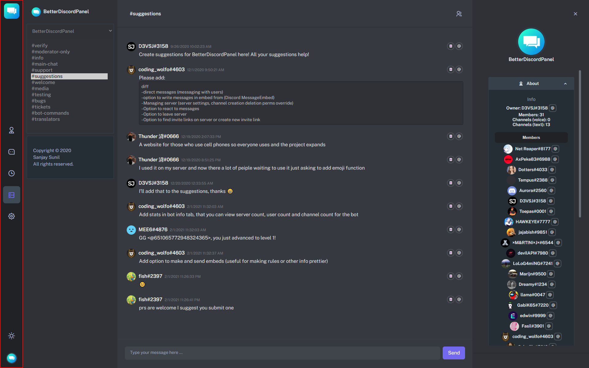

# Rough idea
A simple dashboard for the administration of bot accounts from different websites (discord, telegram, steam and others)
This dashboard would allow to create, configure, reboot, take offline, view activity history and various other features.
## Quick list of possible features
Here is a quick list of the possible features available for this dashboard
- List all bots
	- Filter all the bots
- Create bots from the dashboard
- Configure bots from the dashboard
- Change status
	- Online
	- Offline
	- Reboot
- Stats regarding the bots (uptime, ressource consumption, etc.)
- View logs
- Modular approach provida an API for adding your own bot type
# Inspiration
Here is a short list of all the various inspirations taken for this project
- [ArchiSteamFarm](https://github.com/JustArchiNET/ArchiSteamFarm)
- [BetterDiscordPanel](https://github.com/SanjaySunil/BetterDiscordPanel)
- [pi-hole](https://github.com/pi-hole/pi-hole)
- [Tailwind Starter Kit](https://github.com/creativetimofficial/tailwind-starter-kit)
## What would be great to have
Here is short list of all the various aspects from similar projects that are definetly worth implementing
### Dashboard stats

### Quick actions

### Side panel for easy navigation

# Competition
We can see that most of all the dashbaords have few points in common that would be worth
re-implementing such as a side panel for easy navigation. Some of them also use popups for 
configuring some parts. It would be ideal to implement that for example when creating a new bot,
a dialog box whould pop-up and ask the needed info rather then needing to move to another panel.
# Resources
- [Tailwind dashboard](https://github.com/creativetimofficial/tailwind-starter-kit/tree/main/Dashboard%20Page/html-dashboard-page)
- Color palette
	- Roman Silver: #85839C
	- Jacarta: #343350
	- Space Cadet: #252549
	- Irresistible: #BF3C6B
	- Max Red Purple: #AD3172
	- Violet Red: #831940
	- Peach Orange: #FFC89B
	- Salmon: #FF8B70
	- Pastel Red: #FF5D65
- Font:
# Schema
A link to the schema of the panel can be found on figma [here](https://www.figma.com/file/ijqS9Y1ZltMuP3ozoo1mq7/GUI1?node-id=0%3A1)
